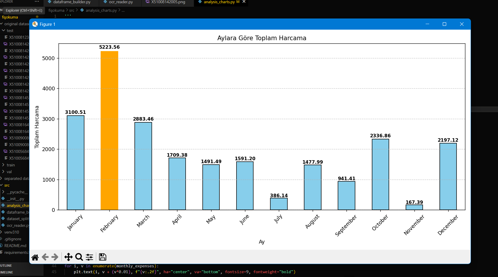
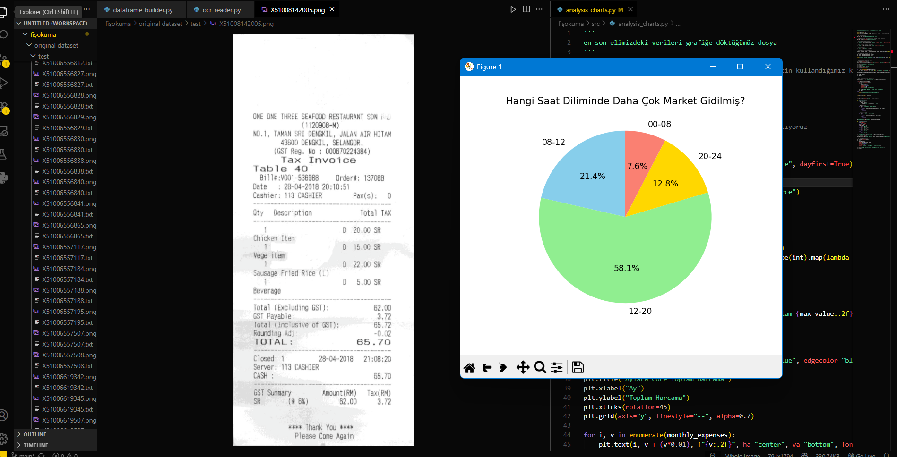

# 📝OCR Receipt Reading and Analysis Project

This project aims to read supermarket receipts using **OCR (Optical Character Recognition)**, convert them into text, and then generate **analysis and charts** from the extracted data.  

From the receipts:
- **Images are processed** (pre-processing steps applied),
- **Read with OCR** and converted into text files,
- **Transferred into a DataFrame and saved as CSV**,
- Finally, **analysis charts** are generated.

The project is built on **Tesseract OCR**.  
Tesseract must be installed on your system in order to run this project.  
You also need to install the required Python libraries. For that, run:  

```bash
pip install -r requirements.txt
```


---

## Execution Steps

### 1️⃣ Dataset Splitting
- **File** `dataset_splitter.py`  
- **Purpose**  
  Splits the original dataset into receipt images and labels.  
  Outputs are saved in the `separated dataset/` folder:  
  - `images/` → receipt images  
  - `labels/` → control purposes (original text files)

### 2️⃣ Reading Images with OCR

- **File** `ocr_reader.py`  
- **Purpose**  
  Processes the images under `separated dataset/images/`,  
  Reads them with OCR,  
  Saves the results as `.txt` files in the `OCR output/` folder,  
  Saves one processed image example in the `processed image/` folder.

### 3️⃣ Building the DataFrame

- **File** `dataframe_builder.py`  
- **Purpose**  
  Reads the text files obtained from OCR,  
  Extracts the fields `store_name`, `date`, `time`, `total`, `payment_method` using regex rules,  
  Creates a DataFrame and saves it as `Dataframe/dataframe.csv`.

### 4️⃣ Analysis and Charts

- **File** `analysis_charts.py`  
- **Purpose**  
  Reads data from the `dataframe.csv` file,  
  Generates charts for:  
  - Monthly total expenses,  
  - Payment method distribution (Cash vs Credit),  
  - Number of receipts by time intervals of the day.
 
  ## 📊 Sample Outputs

### Monthly Expenses by Month


### Payment Method Distribution


### Shopping Time Intervals


